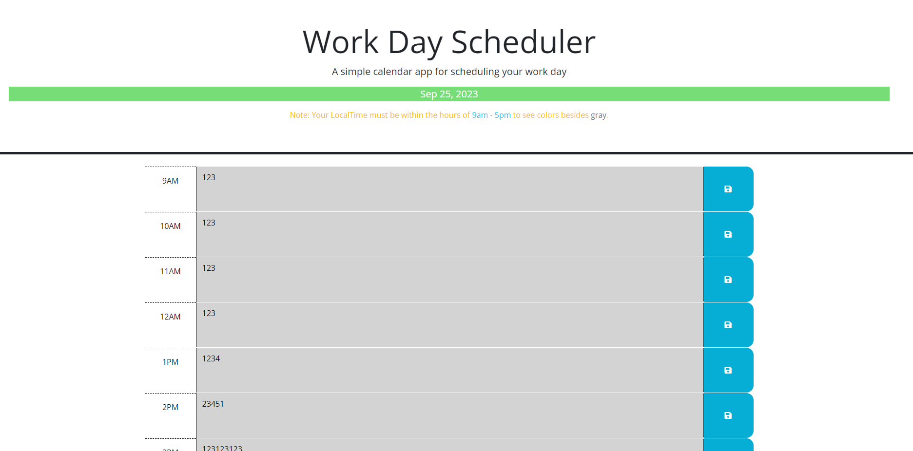

# Week5Scheduler
Week 5 challenge, a day Scheduler.

## Description

Fifth Week - Creating a a dynamically changing scheduler, that will change depending on your local time. EX if it is 9 Am, 9 am will show red and the stuff in the future will be green. We also added a save function that will save the memo entered in the text area to that specific box when the corresponding save button for that box is pressed.

## Links

Github Link: https://github.com/codyleight/Week5Scheduler
Deployed Website : https://codyleight.github.io/Week5Scheduler/

## Usage

Use a Time Slot to set a memo and save your memo to the localstorage. You can also see what time events are in the past future or present depending on their color.
## Credits

Cody Thompson
Repo location on pc: - C:\Users\JC\Desktop\Bootcamp2\Week5Scheduler
used w3 schools.
Used the Xpert Learning assistant to condense my code. Before implementing any suggestions I made sure to understand why and what I was doing. Mainly this was to condense If Statements.
Worked with Bijan Olfati and Jason Mason.

## Photo Preview of Website
 

